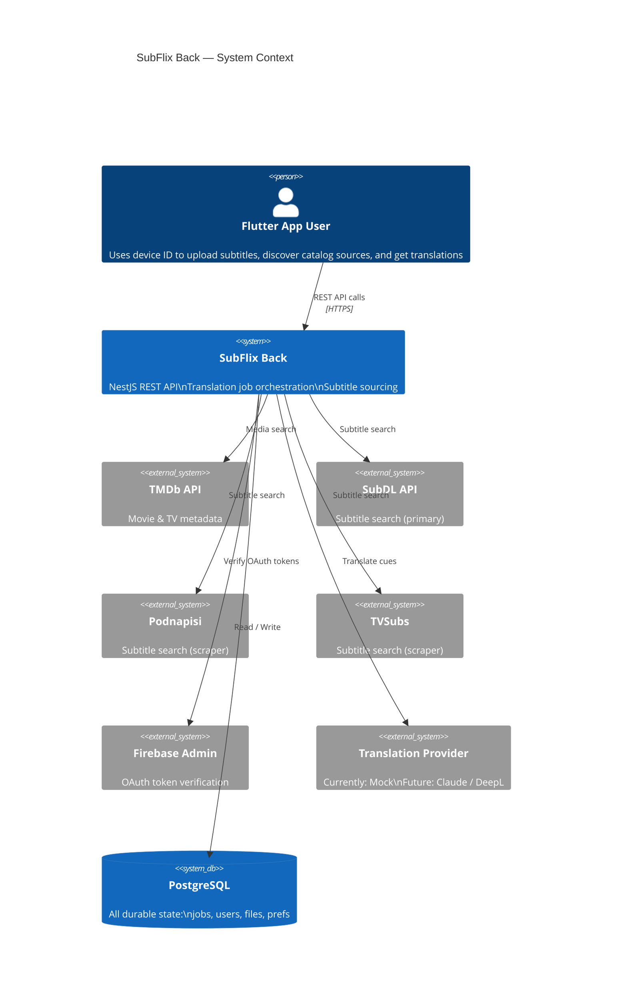
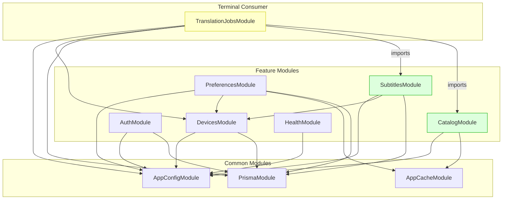
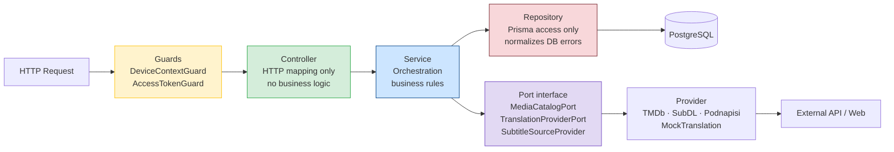
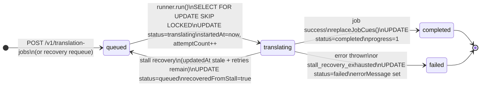
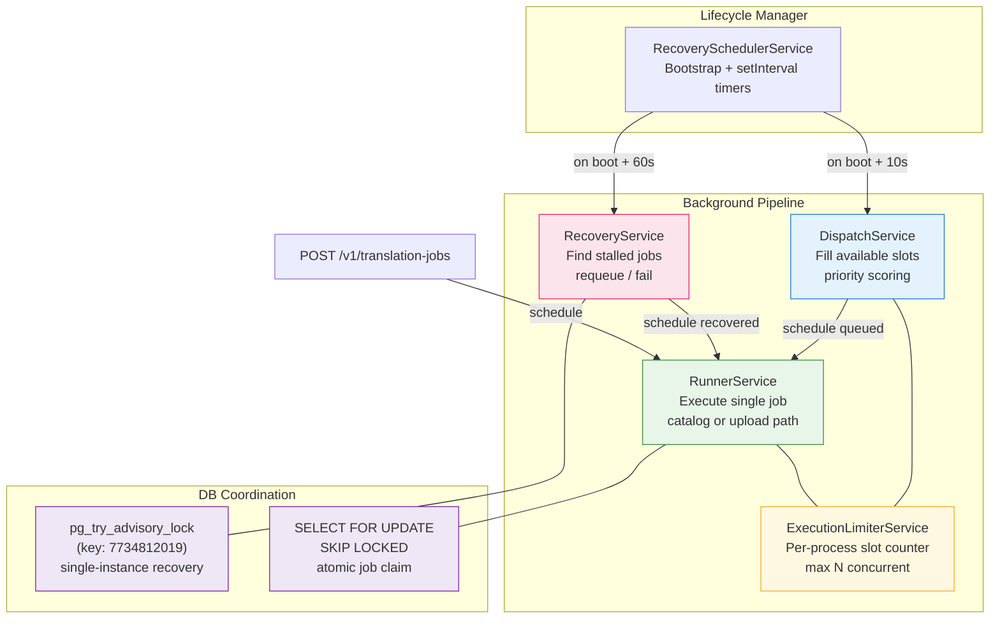
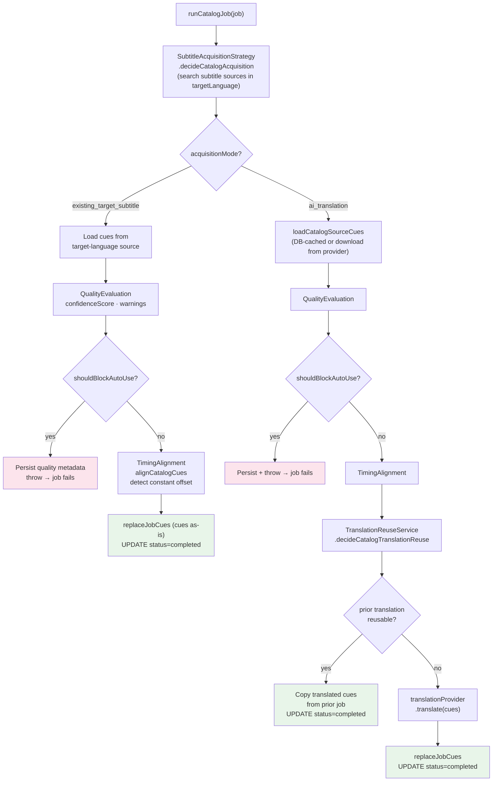
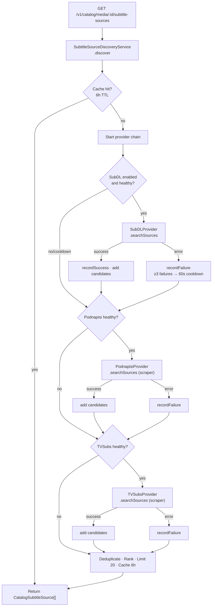
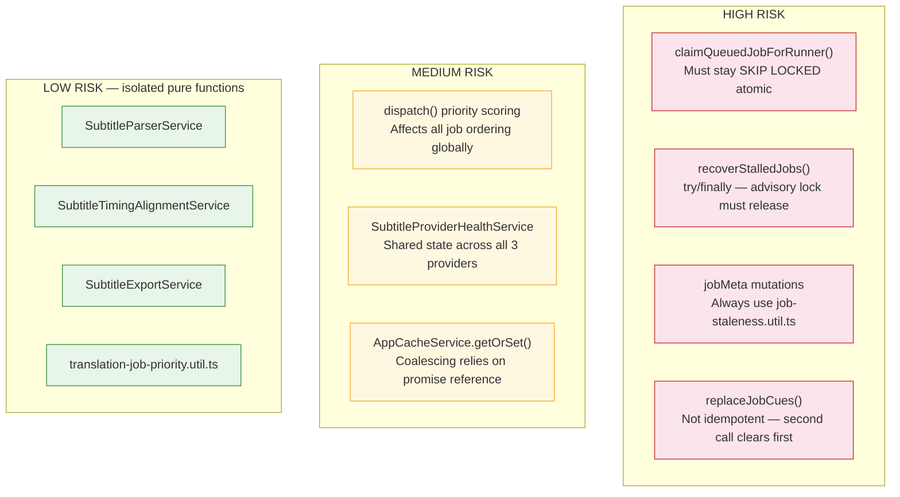
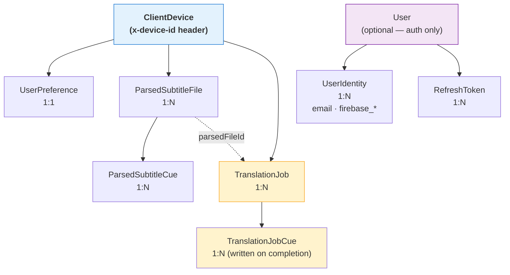

# Key Diagrams

The highest-value diagrams for understanding SubFlix Back quickly. Each diagram is embedded with a one-line explanation and a link to its source document for fuller context.

---

## 1. System Context

> What the backend is, who uses it, and what it talks to.

**Full context:** [VISUAL_ARCHITECTURE.md](VISUAL_ARCHITECTURE.md)

---

## 2. Module Dependency Graph

> Which NestJS modules depend on which. `TranslationJobsModule` is the only cross-feature consumer.

**Full context:** [VISUAL_ARCHITECTURE.md](VISUAL_ARCHITECTURE.md)

---

## 3. Layer Architecture

> The request pipeline every call passes through, from guard to database.

**Full context:** [VISUAL_ARCHITECTURE.md](VISUAL_ARCHITECTURE.md)

---

## 4. TranslationJob Lifecycle State Machine

> The job state machine. Recovery adds a re-entry path from `translating` back to `queued`.

**Full context:** [VISUAL_STATE_MAP.md](VISUAL_STATE_MAP.md)

---

## 5. Background Processing Architecture

> How the scheduler, recovery, dispatch, runner, and limiter interact. This is the async core of the system.

**Full context:** [VISUAL_ARCHITECTURE.md](VISUAL_ARCHITECTURE.md) · [VISUAL_RUNTIME_FLOWS.md](VISUAL_RUNTIME_FLOWS.md)

---

## 6. Catalog Job Decision Tree

> The most complex flow in the system. Every catalog job passes through this branching logic.

**Full context:** [VISUAL_RUNTIME_FLOWS.md](VISUAL_RUNTIME_FLOWS.md)

---

## 7. Subtitle Discovery + Provider Fallback

> How subtitle sources are found for a media item, with circuit-breaker fallback logic.

**Full context:** [VISUAL_RUNTIME_FLOWS.md](VISUAL_RUNTIME_FLOWS.md) · [EXTERNAL_INTEGRATIONS.md](EXTERNAL_INTEGRATIONS.md)

---

## 8. Risky Areas Map

> Before changing anything non-trivial, check this map.

**Full context:** [VISUAL_CONTRIBUTOR_GUIDE.md](VISUAL_CONTRIBUTOR_GUIDE.md) · [CODEBASE_REVIEW_NOTES.md](CODEBASE_REVIEW_NOTES.md)

---

## 9. Entity Relationship Overview

> Ownership hierarchy and key relationships at a glance.

**Full context:** [VISUAL_DATA_MAP.md](VISUAL_DATA_MAP.md) · [DATA_AND_STATE_MODEL.md](DATA_AND_STATE_MODEL.md)

---

## Diagram Export Notes

These diagrams are good candidates for SVG/PNG export (e.g. for wikis, onboarding slides, or README headers):

| Diagram | Priority | Notes |
|---------|----------|-------|
| System Context (C4) | High | Best overview for external audiences |
| TranslationJob Lifecycle | High | Core state machine — reference in any job-related PR |
| Module Dependency Graph | High | Useful in onboarding materials |
| Catalog Job Decision Tree | Medium | Complex; SVG makes it easier to zoom |
| Background Processing Architecture | Medium | Good for ops/infra understanding |
| Risky Areas Map | Medium | Useful to include in contributor onboarding |

To export: run any Mermaid CLI tool (`mmdc`) or use the Mermaid Live Editor at [mermaid.live](https://mermaid.live). Place exported assets in `docs/assets/`.
