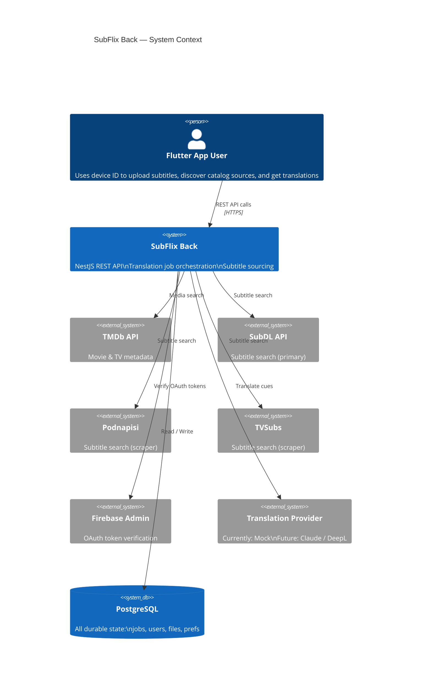
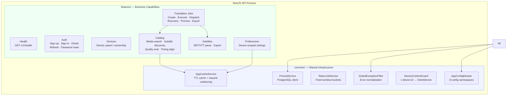
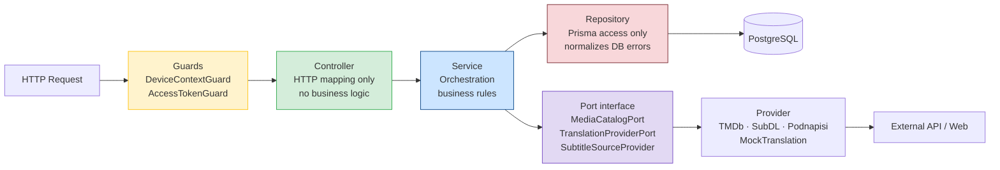
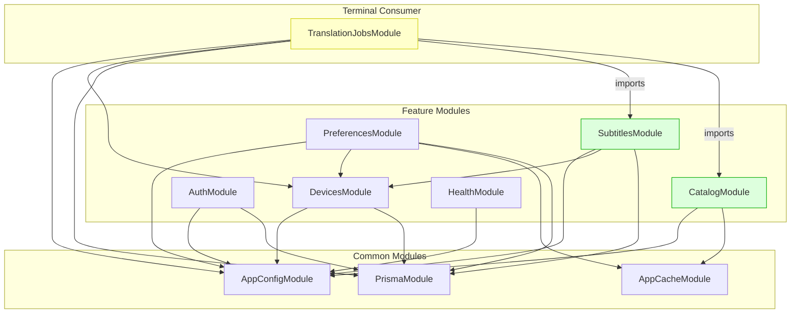
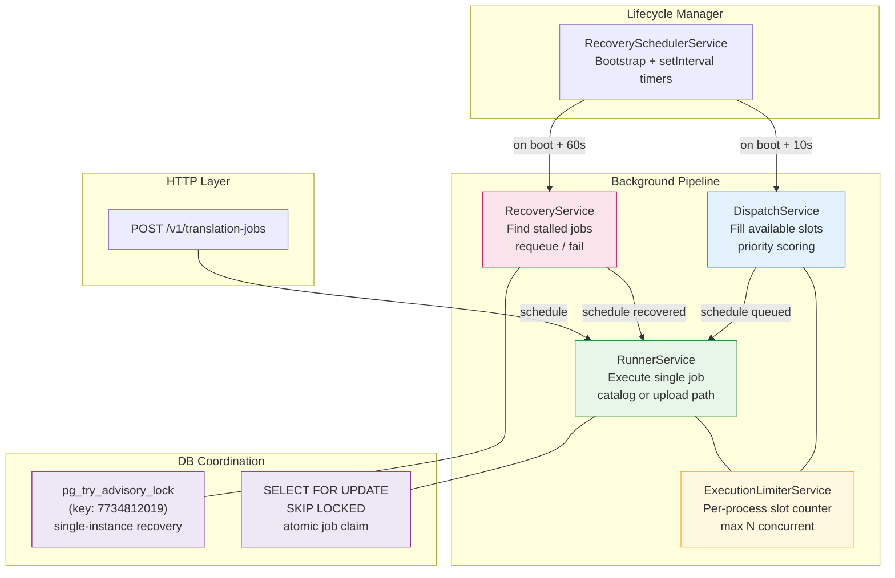
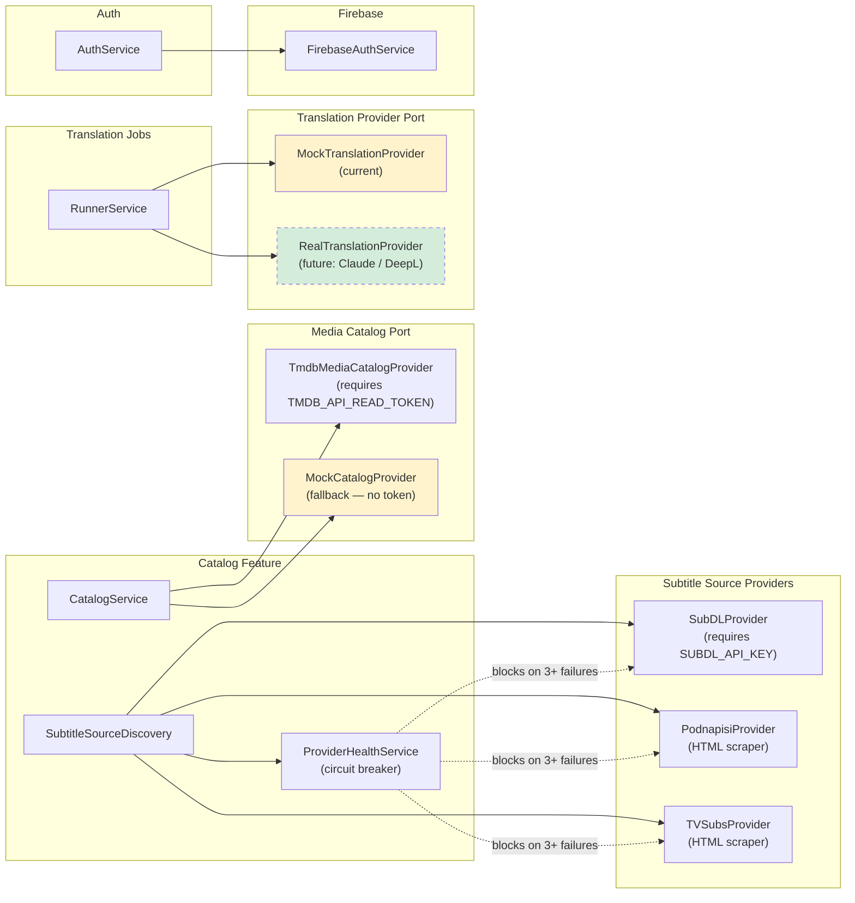

# Visual Architecture

> **Docs index:** [README.md](README.md) · **See also:** [BACKEND_ARCHITECTURE_OVERVIEW.md](BACKEND_ARCHITECTURE_OVERVIEW.md) · [VISUAL_RUNTIME_FLOWS.md](VISUAL_RUNTIME_FLOWS.md) · [KEY_DIAGRAMS.md](KEY_DIAGRAMS.md)
>
> **Covers:** system context, module layout, layer diagram, background processing, integrations map.
> **Does not cover:** runtime flows (→ VISUAL_RUNTIME_FLOWS), state machines (→ VISUAL_STATE_MAP), data model (→ VISUAL_DATA_MAP).

---

## System Context

> Who uses the system and what does it talk to?

---

## Container View — Feature Modules

> How is the backend internally divided?

---

## Layer Architecture

> Every request passes through these layers in order.

**Rules enforced:**
- Services never import `PrismaService` directly
- Controllers never call repositories
- Providers are only injected through port tokens — no direct class references in services

---

## Feature Dependency Graph

> Which feature modules depend on which others?

> **Key insight:** Only `TranslationJobsModule` imports other feature modules. All others are self-contained.

---

## Background Processing Architecture

> How jobs run asynchronously inside the API process.

---

## External Integrations Map

> What the system calls out to, where it's abstracted, and what happens when it fails.

**Legend:**
- Solid border = active implementation
- Dashed border = not yet implemented
- Yellow fill = mock/fallback
