# Visual Runtime Flows

> **Docs index:** [README.md](README.md) · **See also:** [VISUAL_ARCHITECTURE.md](VISUAL_ARCHITECTURE.md) · [VISUAL_STATE_MAP.md](VISUAL_STATE_MAP.md) · [KEY_DIAGRAMS.md](KEY_DIAGRAMS.md)
>
> **Covers:** 12 runtime flows with diagrams — auth, upload, catalog search, subtitle discovery, job creation, job execution (both paths), catalog decision tree, target-language reuse, translation reuse, stall recovery, dispatch.
> **Does not cover:** state machine internals (→ VISUAL_STATE_MAP), data model (→ VISUAL_DATA_MAP), module structure (→ VISUAL_ARCHITECTURE).

Each section shows a single runtime flow with a diagram and a brief explanation. Flows are ordered from simple to complex.

---

## 1. Auth — Sign-Up

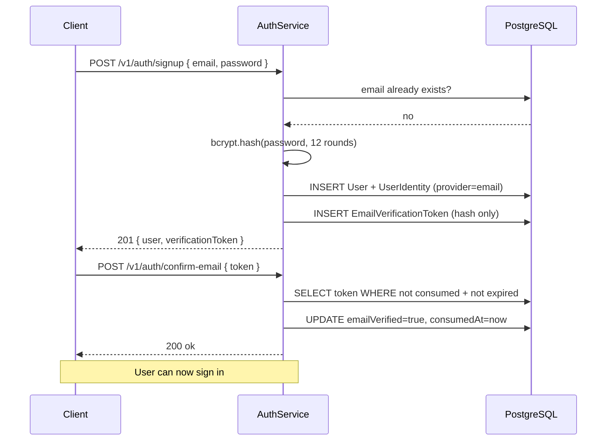

---

## 2. Auth — Sign-In and Token Refresh

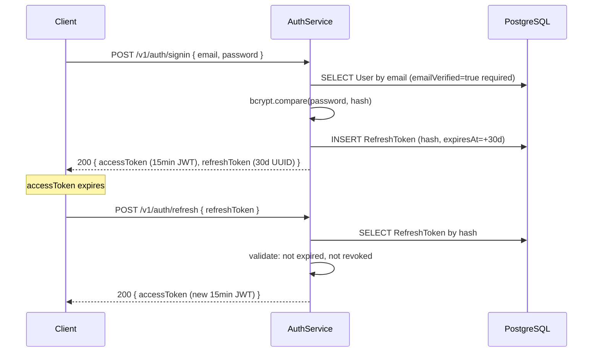

---

## 3. Subtitle Upload Flow

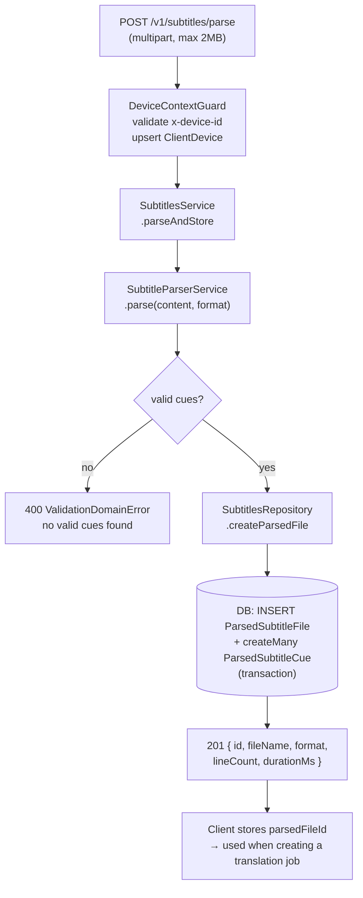

---

## 4. Catalog Media Search

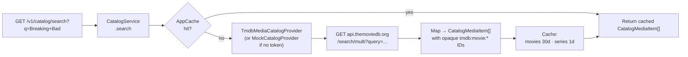

---

## 5. Catalog Subtitle Discovery + Provider Fallback

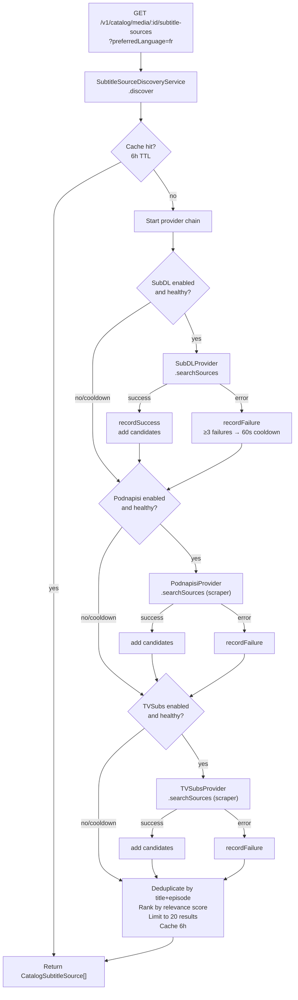

---

## 6. Translation Job Creation

Two source types share the same creation path but differ in what gets persisted.

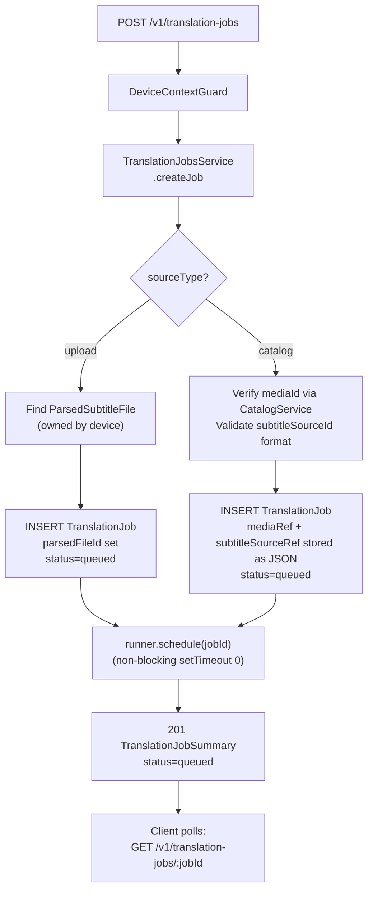

---

## 7. Async Translation Job Execution

Full execution flow after `runner.schedule(jobId)` fires.

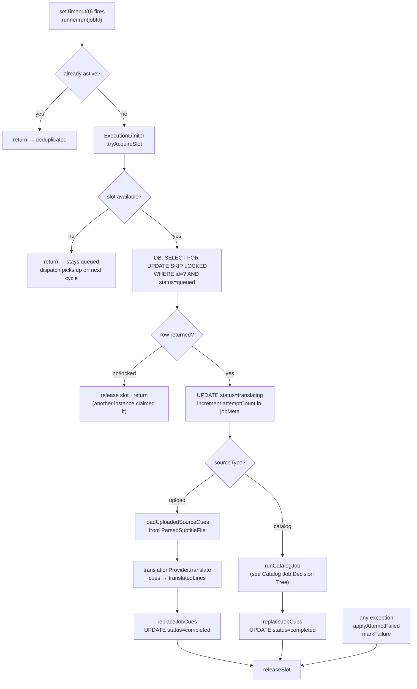

---

## 8. Catalog Job Decision Tree

Expanded view of `runCatalogJob()` — the most complex branch in the system.

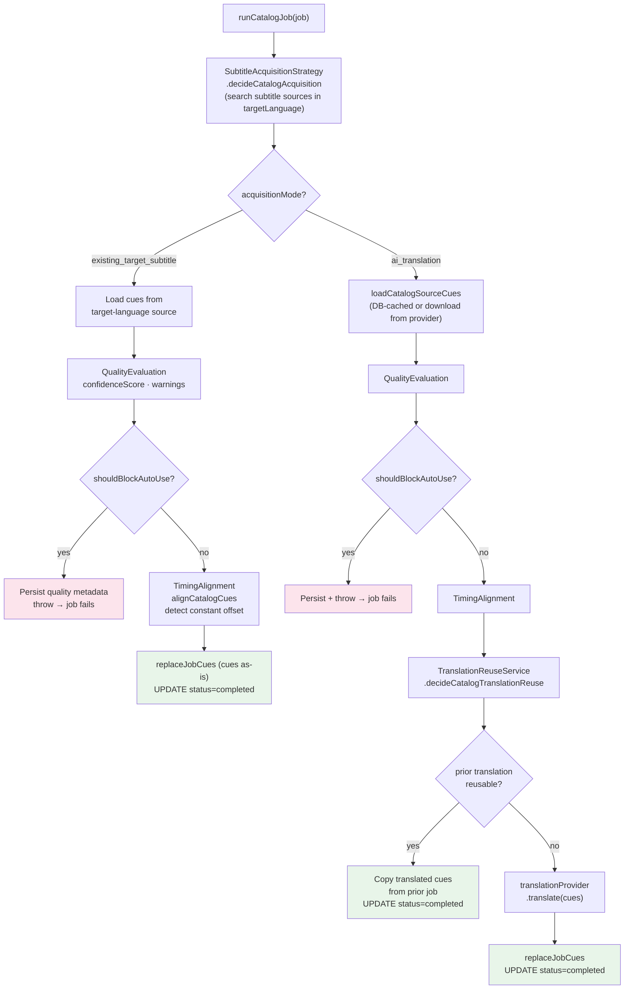

---

## 9. Target-Language Subtitle Reuse Flow

Runs at the start of every catalog job inside `SubtitleAcquisitionStrategyService`.

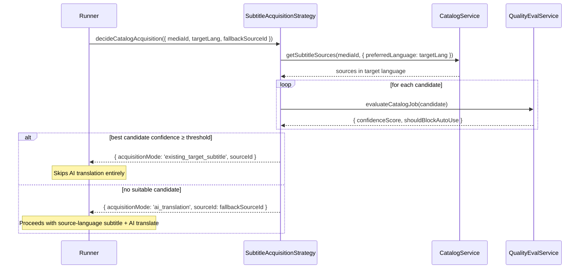

---

## 10. Translation Reuse Flow

Runs on the `ai_translation` path before calling the translation provider.

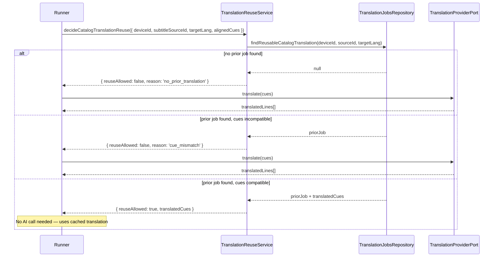

---

## 11. Stalled Job Recovery Flow

Runs on startup and every 60 seconds. Advisory lock ensures single-instance execution.

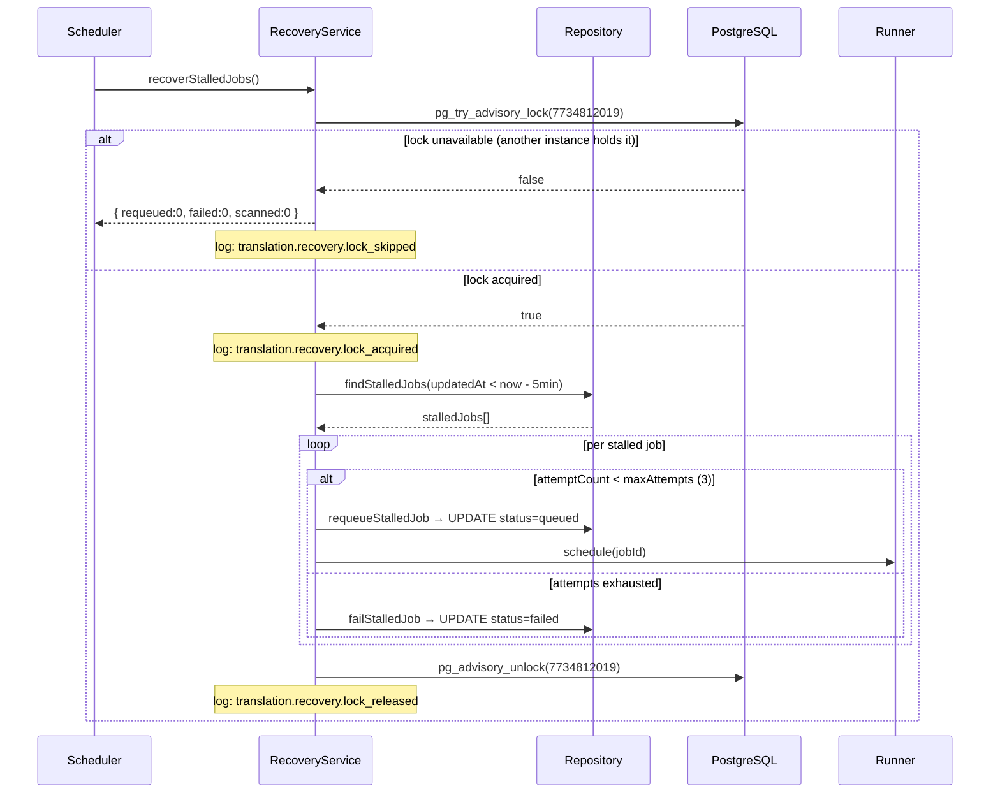

---

## 12. Dispatch + Concurrency Flow

Runs on startup and every 10 seconds to fill available execution slots.

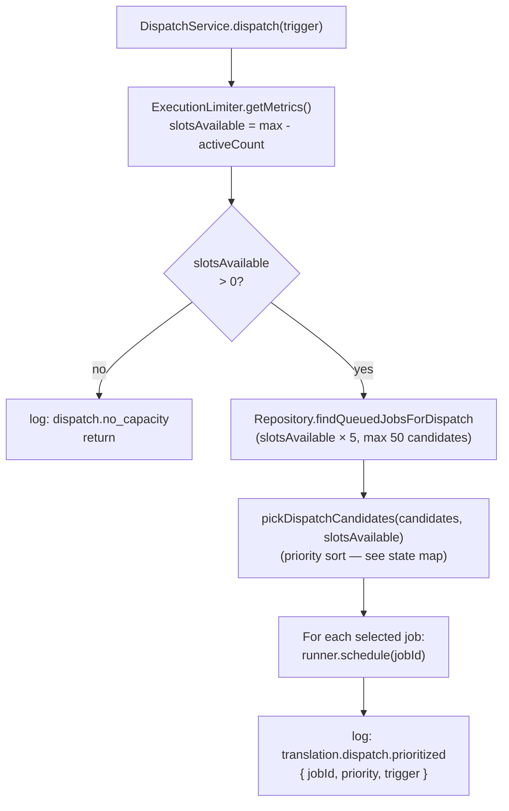

**Priority scoring table:**

| Job Type | Score | Notes |
|----------|-------|-------|
| CATALOG (fresh) | 10 | May short-circuit via subtitle reuse |
| UPLOAD (fresh) | 20 | Always needs AI translation |
| RECOVERED (fresh) | 30 | Deprioritized — already failed once |
| RECOVERED (> 5min old) | 10 | Promoted to prevent starvation |

Lower score = higher priority. Within same score: FIFO by `createdAt`.
