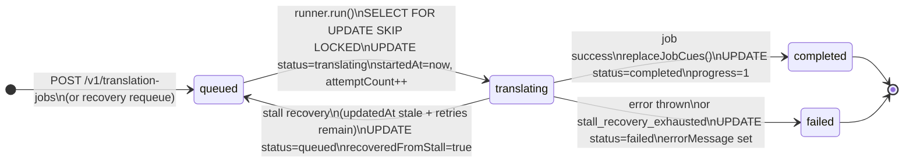
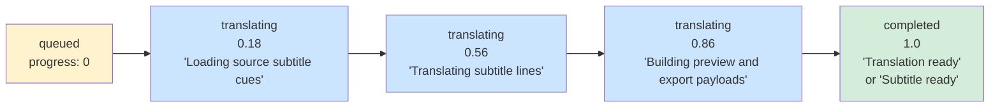
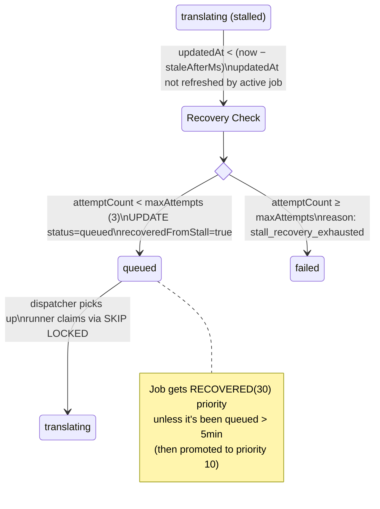
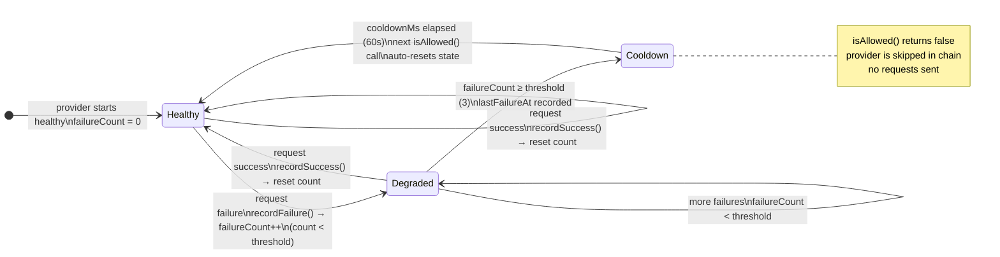
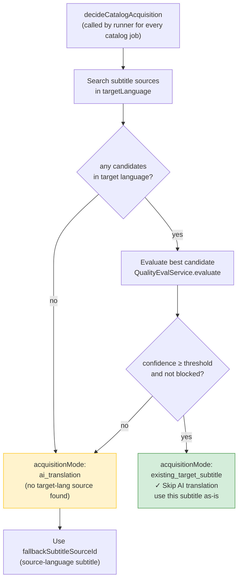
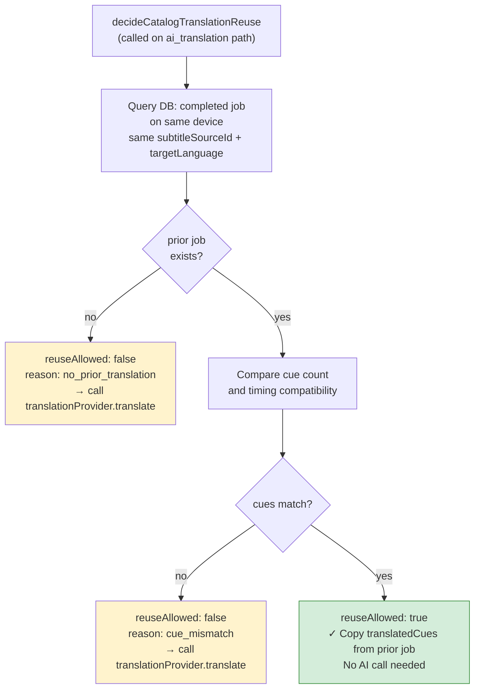
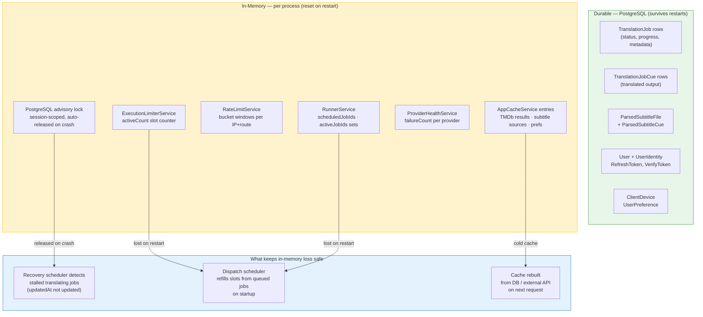

# Visual State Map

> **Docs index:** [README.md](README.md) · **See also:** [VISUAL_RUNTIME_FLOWS.md](VISUAL_RUNTIME_FLOWS.md) · [DATA_AND_STATE_MODEL.md](DATA_AND_STATE_MODEL.md) · [KEY_DIAGRAMS.md](KEY_DIAGRAMS.md)
>
> **Covers:** TranslationJob state machine, progress milestones, stall recovery transitions, circuit breaker states, acquisition decision tree, translation reuse decision tree, durable vs in-memory state.
> **Does not cover:** how states are reached step-by-step (→ VISUAL_RUNTIME_FLOWS), full field-level data model (→ DATA_AND_STATE_MODEL).

All important states, transitions, and decision trees in one document.

---

## 1. TranslationJob Lifecycle

---

## 2. Job Progress Milestones

> `stageLabel` and `progress` are written at fixed checkpoints — not real percentages.

---

## 3. Stall Recovery State Transitions

---

## 4. Provider Circuit Breaker State

Applies to SubDL, Podnapisi, and TVSubs independently.

---

## 5. Subtitle Acquisition Decision Tree

> Every catalog job starts here. The outcome determines whether AI translation runs.

---

## 6. Translation Reuse Decision Tree

> Only runs on the `ai_translation` path, after timing alignment, before calling the provider.

---

## 7. Durable vs In-Memory State Map

**Key guarantee:** No queued or stalled job is permanently lost when a process restarts. All recovery paths run from DB state.
