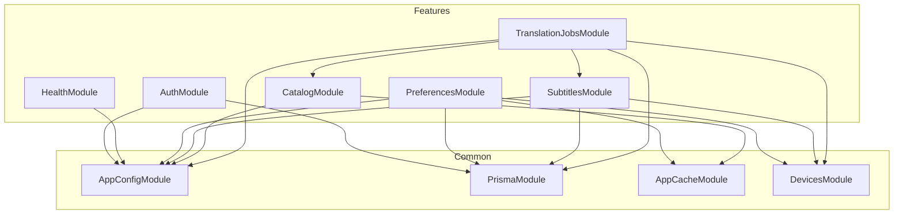
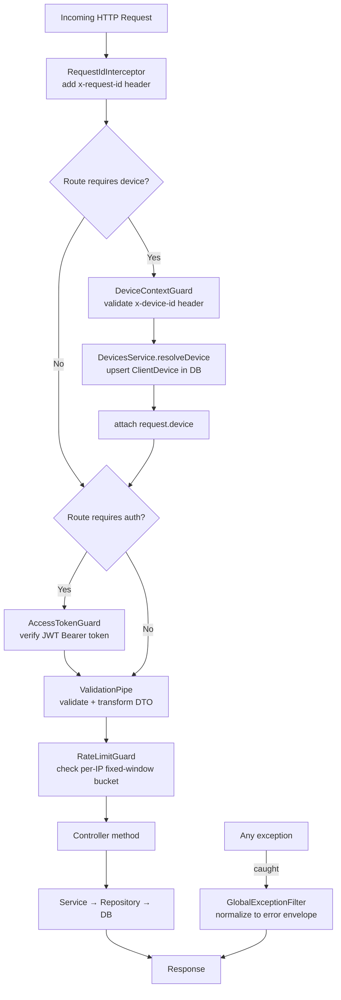
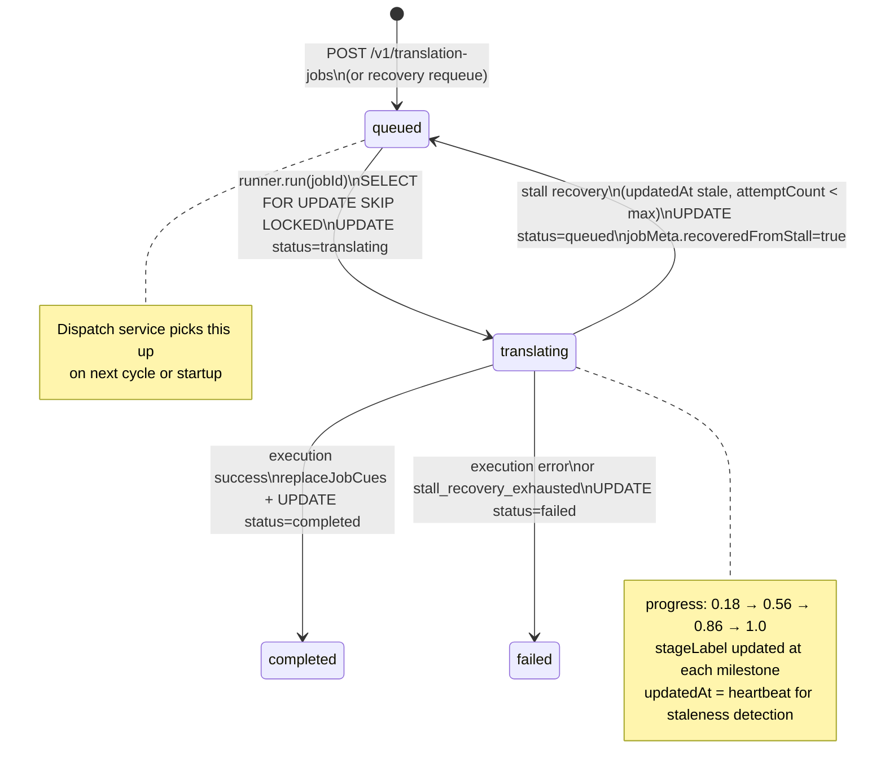
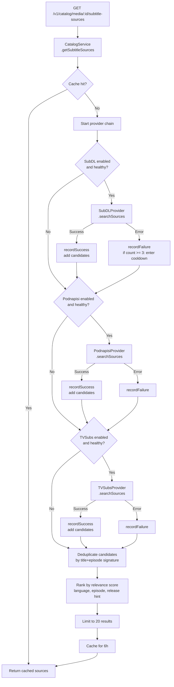
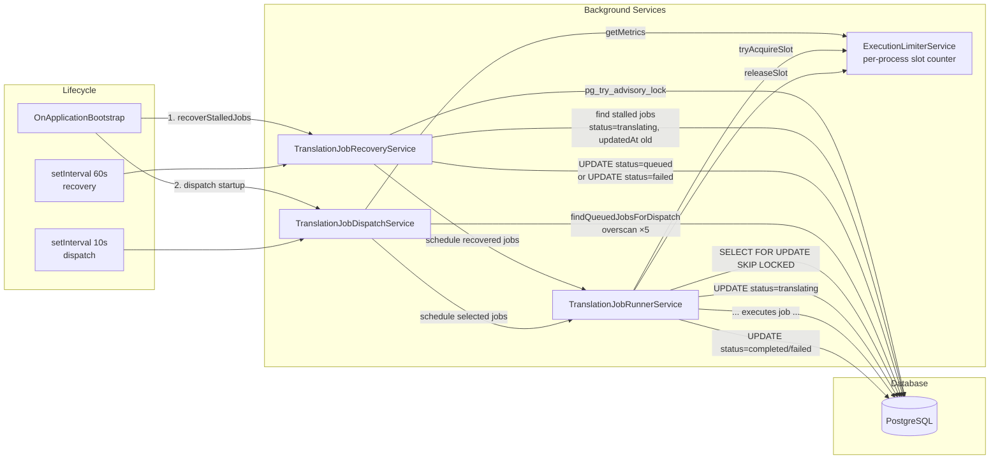
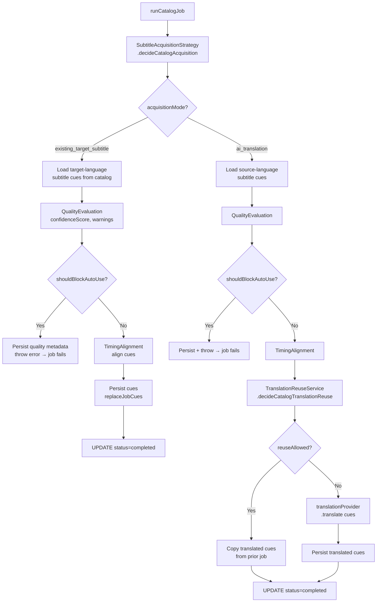
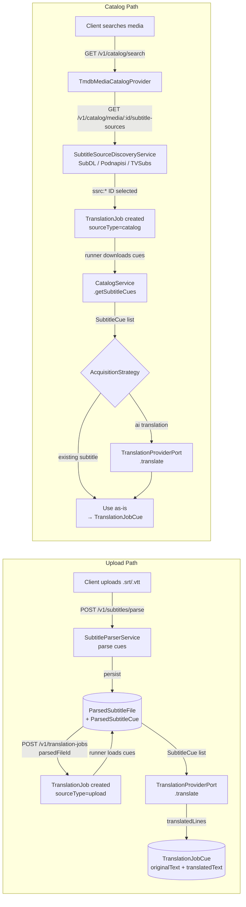
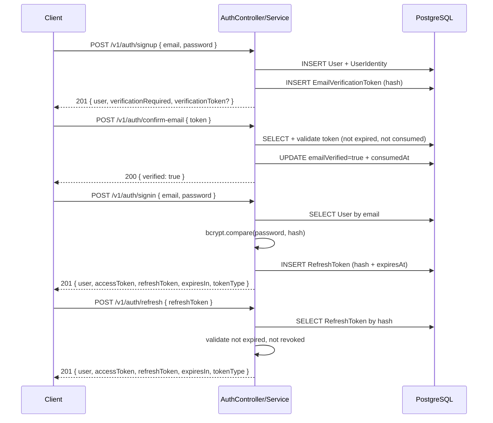
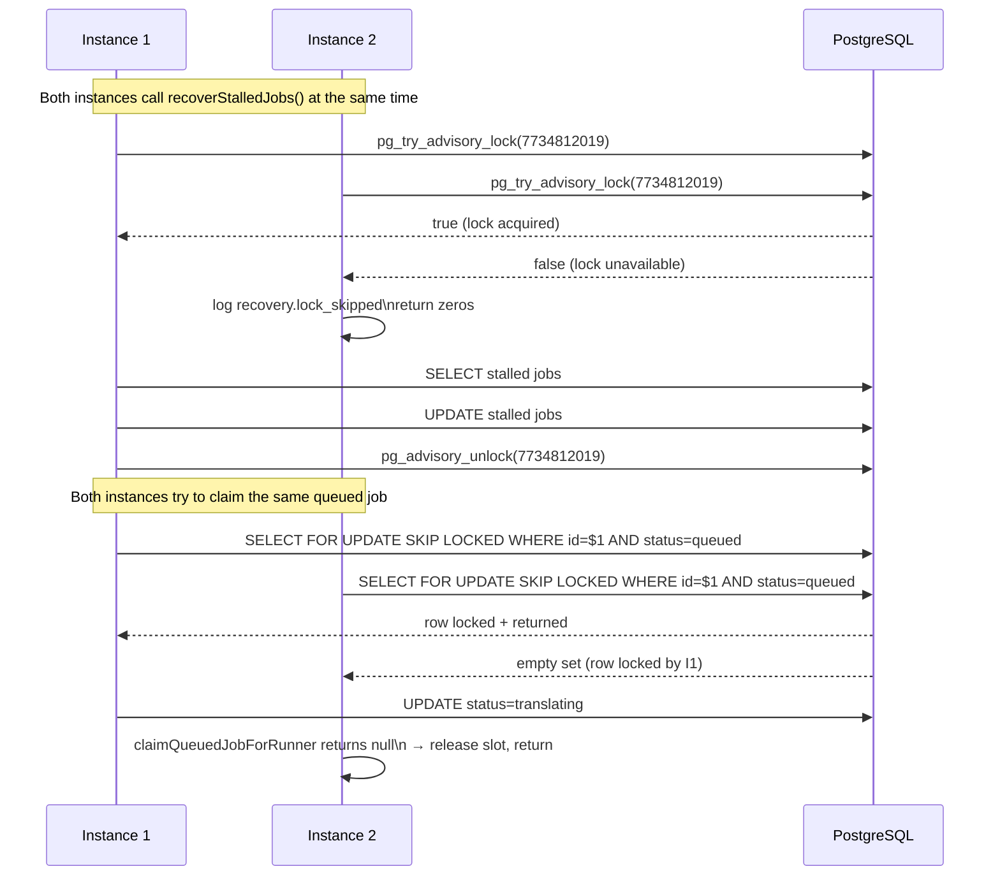

# Diagrams

A focused reference of system diagrams. Each diagram has a short explanation of what it shows and why it matters.

---

## 1. Module Dependency Graph

Shows which NestJS feature modules depend on which others, and which common modules they all rely on.

**Key insight:** `TranslationJobsModule` is the only module that imports other feature modules. It depends on both `CatalogModule` (for subtitle discovery and cue fetching) and `SubtitlesModule` (for loading uploaded cues). Everything else is self-contained.

---

## 2. HTTP Request Lifecycle

Shows the middleware/guard/interceptor pipeline every incoming request passes through before reaching controller logic.

---

## 3. Translation Job Lifecycle

Shows the full state machine for a `TranslationJob` record, including the recovery re-entry path.

---

## 4. Subtitle Discovery and Provider Fallback

Shows the provider chain logic in `SubtitleSourceDiscoveryService.discover()`.

---

## 5. Dispatch / Runner / Recovery Interactions

Shows how the three background components (scheduler, dispatch, recovery, runner) interact with the DB and each other.

---

## 6. Catalog Job Execution Decision Tree

Shows the branching logic inside `runCatalogJob()` that determines how a catalog job completes.

---

## 7. Data Flow: Upload Path vs Catalog Path

Compares how data moves for the two job source types.

---

## 8. Auth Flow Overview

Shows the sign-up / sign-in token issuance and refresh cycle.

---

## 9. Multi-Instance Coordination

Shows how two API instances coordinate without duplicate work.

