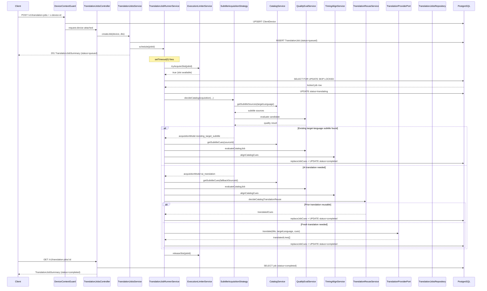
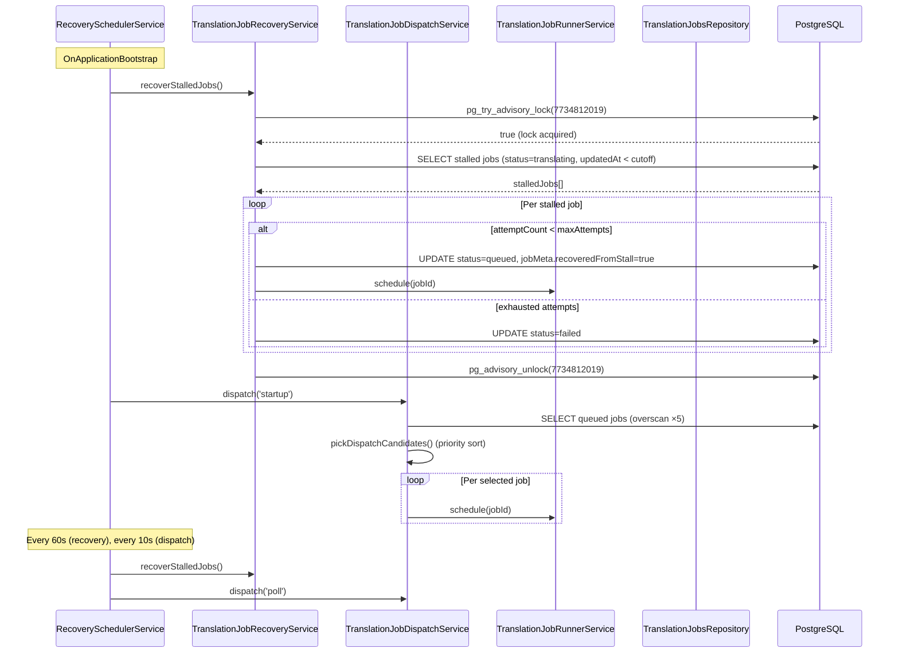

# Request and Job Flows

This document traces the most important runtime flows from HTTP request to database write (or background job completion).

---

## Auth Flow — Email Sign-Up and Sign-In

### Sign-Up

**Entry point:** `POST /v1/auth/signup`

```
Client
  │ POST /v1/auth/signup { email, password, displayName? }
  ▼
AuthController.signUp()
  │ → ValidationPipe validates SignUpDto
  ▼
AuthService.signUp()
  │ 1. Normalize email to lowercase
  │ 2. Check if email already exists → ConflictDomainError if so
  │ 3. bcrypt.hash(password, saltRounds)
  │ 4. Create User + UserIdentity (provider=email) in DB
  │ 5. Generate email verification token (opaque token), store hash in EmailVerificationToken
  │ 6. Return { user, verificationRequired, verificationToken? }
  ▼
Client receives 201 with user object + verificationRequired
  (verificationToken is echoed only when debug token echo is enabled)
```

### Sign-In

**Entry point:** `POST /v1/auth/signin`

```
Client
  │ POST /v1/auth/signin { email, password }
  ▼
AuthService.signIn()
  │ 1. Find User by email (normalized)
  │ 2. Reject if emailVerified = false
  │ 3. bcrypt.compare(password, user.passwordHash)
  │ 4. Generate JWT access token (15min TTL)
  │ 5. Generate refresh token (opaque token), store hash + expiresAt in RefreshToken
  │ 6. Return { user, accessToken, refreshToken, expiresIn, tokenType }
  ▼
Client stores tokens; uses accessToken in Authorization header
```

---

## Subtitle Upload Flow

**Entry point:** `POST /v1/subtitles/parse`

```
Client
  │ POST /v1/subtitles/parse  (multipart, file field = 'file')
  │ Headers: x-device-id: <deviceId>
  ▼
DeviceContextGuard
  │ 1. Validate x-device-id header present + safe
  │ 2. DevicesService.resolveDevice(deviceId)  →  upsert ClientDevice row
  │ 3. Attach ClientDevice to request.device
  ▼
SubtitlesController.parseSubtitle()
  │ Multer middleware: buffer uploaded file (max 2MB)
  ▼
SubtitlesService.parseAndStore(device, file)
  │ 1. Validate file present, check size <= MAX_UPLOAD_BYTES
  │ 2. Detect format from extension (.srt or .vtt)
  │ 3. SubtitleParserService.parse(fileContent, format)
  │    - Normalize line endings (\r\n → \n)
  │    - Split by blank lines into cue blocks
  │    - Per block: extract cueIndex, parse timecodes, extract text
  │    - Throw ValidationDomainError if < 1 valid cue found
  │ 4. SubtitlesRepository.createParsedFile({ device, fileName, format, cues, ... })
  │    - Transaction: INSERT ParsedSubtitleFile + createMany ParsedSubtitleCue
  │ 5. Return { id, fileName, format, sourceLanguage, lineCount, durationMs }
  ▼
Client receives 201 with file metadata
Client stores parsedFileId for use when creating a translation job
```

---

## Catalog Media Search Flow

**Entry point:** `GET /v1/catalog/search?q=<query>`

```
Client
  │ GET /v1/catalog/search?q=Breaking+Bad
  ▼
CatalogController.search()
  ▼
CatalogService.search(query)
  │ → mediaProvider.search(query)   [MediaCatalogPort injection]
  ▼
TmdbMediaCatalogProvider.search(query)    (or MockCatalogProvider if no token)
  │ 1. Build cache key from query
  │ 2. AppCacheService.getOrSet(cacheKey, loader, ttl)
  │    - If cached: return immediately
  │    - If not cached (or concurrent miss): single outbound HTTP call
  │      GET https://api.themoviedb.org/3/search/multi?query=<q>
  │      Map results to CatalogMediaItem[]
  │      Cache under separate keys by type:
  │        - Movies: 30d TTL
  │        - TV series: 1d TTL
  │ 3. Return CatalogMediaItem[]
  ▼
Client receives list of { id, title, year, mediaType, posterUrl, popularity, genres }
```

---

## Catalog Subtitle Discovery Flow

**Entry point:** `GET /v1/catalog/media/:mediaId/subtitle-sources`

```
Client
  │ GET /v1/catalog/media/tmdb:tv:1396/subtitle-sources
  │   ?preferredLanguage=fr&seasonNumber=1&episodeNumber=1
  ▼
CatalogController.getSubtitleSources()
  │ Validate: if TV, both seasonNumber and episodeNumber required
  ▼
CatalogService.getSubtitleSources(mediaId, query)
  ▼
SubtitleSourceDiscoveryService.discover(media, query)
  │ 1. Check AppCacheService (cache key includes mediaId + language + episode)
  │ 2. On cache miss, iterate provider chain:
  │
  │    For each enabled provider (SubDL → Podnapisi → TVSubs):
  │      a. SubtitleProviderHealthService.isAllowed(provider)
  │         - Skip if in cooldown (3+ failures within 60s)
  │      b. provider.searchSources(input)   [SubtitleSourceProvider interface]
  │      c. SubtitleProviderHealthService.recordSuccess/recordFailure
  │      d. Add candidates to collection
  │
  │ 3. Deduplicate by normalized title + episode signature
  │ 4. Rank by relevance score (language match, episode match, release hint)
  │ 5. Limit to 20 results
  │ 6. Cache result for 6h
  │
  │ 7. Return CatalogSubtitleSource[] with opaque ssrc:* IDs
  ▼
Client receives subtitle source options to show in UI
```

---

## Translation Job Creation Flow

**Entry point:** `POST /v1/translation-jobs`

### Upload-source job

```
Client
  │ POST /v1/translation-jobs
  │ { sourceType: 'upload', parsedFileId, targetLanguage: 'fr', format: 'srt', title: '...' }
  │ Headers: x-device-id: <deviceId>
  ▼
DeviceContextGuard  →  resolves + attaches device
  ▼
TranslationJobsService.createJob(device, dto)
  │ 1. Find ParsedSubtitleFile by parsedFileId owned by device
  │ 2. Create TranslationJob with status=queued, sourceType=upload, parsedFileId set
  │ 3. runner.schedule(jobId)   ← non-blocking, returns immediately
  │ 4. Return TranslationJobSummary (status=queued)
  ▼
Client receives 201 immediately; starts polling GET /v1/translation-jobs/:jobId
```

### Catalog-source job

```
Client
  │ POST /v1/translation-jobs
  │ { sourceType: 'catalog', mediaId, subtitleSourceId, targetLanguage, ... }
  ▼
TranslationJobsService.createJob(device, dto)
  │ 1. Verify mediaId exists via CatalogService.findById()
  │ 2. Validate subtitle source ID format
  │ 3. Create TranslationJob with status=queued, mediaRef + subtitleSourceRef stored as JSON
  │ 4. runner.schedule(jobId)
  │ 5. Return TranslationJobSummary (status=queued)
  ▼
Client receives 201 immediately
```

---

## Async Translation Job Execution Flow

This flow begins after `runner.schedule(jobId)` has been called (from job creation, dispatch service, or recovery).

```
setTimeout(0) fires
  │
  ▼
TranslationJobRunnerService.run(jobId)
  │ 1. Dedup check: activeJobIds.has(jobId) → return if already running
  │ 2. executionLimiter.tryAcquireSlot(jobId)
  │    - If at capacity (activeCount >= maxConcurrency): return
  │      (job stays queued; dispatch service will pick it up on next cycle)
  │ 3. Atomic claim: repository.claimQueuedJobForRunner(jobId)
  │    SELECT id FROM TranslationJob
  │    WHERE id = $1 AND status = 'queued'
  │    FOR UPDATE SKIP LOCKED
  │    → UPDATE status = 'translating', startedAt = now
  │    - Returns null if job was claimed by another instance (or is not queued)
  │ 4. If null → release slot, return
  │ 5. Read current jobMeta, apply applyAttemptStarted() → increment attemptCount
  │ 6. Persist updated jobMeta
  │
  │   ┌─────────────────┬──────────────────────┐
  │   │ sourceType=catalog │ sourceType=upload  │
  │   └────────┬────────┘└──────────┬───────────┘
  │            ▼                    ▼
  │    runCatalogJob()      runUploadJob()
  │
  │ finally:
  │   activeJobIds.delete(jobId)
  │   executionLimiter.releaseSlot(jobId)
```

### Catalog Job Execution Path

```
runCatalogJob(job)
  │
  ▼
SubtitleAcquisitionStrategyService.decideCatalogAcquisition()
  │ 1. Fetch media details from CatalogService
  │ 2. Search subtitle sources in targetLanguage
  │ 3. Evaluate best candidate's quality
  │ 4. If quality score sufficient → acquisitionMode = 'existing_target_subtitle'
  │ 5. Else → acquisitionMode = 'ai_translation'
  │
  ├── acquisitionMode = 'existing_target_subtitle'
  │     ▼
  │   completeCatalogJobWithReuse()
  │     1. Load cues from selected target-language source
  │     2. SubtitleQualityEvaluationService.evaluateCatalogJob()
  │     3. If shouldBlockAutoUse → throw (job fails with quality error)
  │     4. SubtitleTimingAlignmentService.alignCatalogCues()
  │     5. Persist quality + timing metadata to subtitleSourceRef
  │     6. replaceJobCues() with cues (originalText = translatedText = cue.text)
  │     7. updateJob(status=completed, progress=1)
  │
  └── acquisitionMode = 'ai_translation'
        ▼
      completeCatalogJobWithTranslation()
        1. loadCatalogSourceCues()
           - Check if DB already has cues for this source (reuse DB-cached cues)
           - Else download from provider via CatalogService.getSubtitleCues()
        2. SubtitleQualityEvaluationService.evaluateCatalogJob()
        3. If shouldBlockAutoUse → throw
        4. SubtitleTimingAlignmentService.alignCatalogCues()
        5. TranslationReuseService.decideCatalogTranslationReuse()
           - Query: completed job on same device, same subtitleSourceId + targetLanguage
           - Validate cue-level compatibility
           ├── reuseAllowed = true
           │     replaceJobCues() with reused translated cues
           │     updateJob(status=completed)
           │
           └── reuseAllowed = false
                 translationProvider.translate({title, targetLanguage, cues})
                 replaceJobCues() with translated cues
                 updateJob(status=completed)
```

### Upload Job Execution Path

```
runUploadJob(job)
  │ 1. SubtitlesRepository.listOwnedParsedFileCues(deviceId, parsedFileId)
  │ 2. translationProvider.translate({title, targetLanguage, cues})
  │ 3. replaceJobCues() with translated cues
  │ 4. updateJob(status=completed, progress=1)
```

---

## Dispatch / Concurrency Flow

This flow runs on startup and periodically (every 10s by default).

```
TranslationJobRecoverySchedulerService
  │ OnApplicationBootstrap:
  │   1. recoverStalledJobs()    [see recovery flow below]
  │   2. dispatchService.dispatch('startup')
  │
  │ setInterval (10s):
  │   dispatchService.dispatch('poll')
  ▼

TranslationJobDispatchService.dispatch(trigger)
  │ 1. executionLimiter.getMetrics()
  │    → {activeCount, maxConcurrency}
  │    → slotsAvailable = maxConcurrency - activeCount
  │ 2. If slotsAvailable <= 0 → log 'dispatch.no_capacity', return
  │ 3. repository.findQueuedJobsForDispatch(slotsAvailable)
  │    - Fetches (slotsAvailable × 5, max 50) oldest queued jobs
  │    - Returns sourceType, createdAt, jobMeta per candidate
  │ 4. pickDispatchCandidates(candidates, slotsAvailable)
  │    - Score each job:
  │      CATALOG jobs with fresh createdAt → priority 10
  │      UPLOAD jobs → priority 20
  │      RECOVERED jobs (jobMeta.recoveredFromStall=true) → priority 30
  │      RECOVERED past fairness threshold (5min) → promoted to 10
  │    - Sort by (priority ASC, createdAt ASC)
  │    - Take first slotsAvailable
  │ 5. For each selected job: runner.schedule(jobId)
  │    Log 'translation.dispatch.prioritized'
```

---

## Stalled Job Recovery Flow

Runs on startup and periodically (every 60s by default).

```
TranslationJobRecoveryService.recoverStalledJobs()
  │ 1. Check recoveryEnabled config → return zeros if disabled
  │ 2. repository.tryAcquireRecoveryAdvisoryLock()
  │    SELECT pg_try_advisory_lock(7734812019)
  │    - Returns false immediately if another instance holds the lock
  │    → log 'translation.recovery.lock_skipped', return zeros
  │ 3. log 'translation.recovery.lock_acquired'
  │
  │ try:
  │   runRecovery()
  │     1. staleBeforeDate = now - staleAfterMs (default: now - 5min)
  │     2. findStalledJobs({ staleBeforeDate })
  │        SELECT jobs WHERE status='translating' AND updatedAt < staleBeforeDate
  │     3. For each stalled job:
  │        meta = parseJobRetryMeta(job.jobMeta)
  │        ├── canRetryAfterStall(meta, maxAttempts)?
  │        │     → requeueStalledJob(jobId, recoveredMeta)   [atomic UPDATE WHERE status=translating]
  │        │     → runner.schedule(jobId)
  │        │     → requeued++
  │        │
  │        └── exhausted attempts
  │              → failStalledJob(jobId, failedMeta, reason)
  │              → failed++
  │     4. Return { requeued, failed, scanned }
  │
  │ finally:
  │   repository.releaseRecoveryAdvisoryLock()
  │   log 'translation.recovery.lock_released'
```

---

## Provider Fallback / Circuit Breaker Flow

Occurs during `SubtitleSourceDiscoveryService.discover()`.

```
For each provider in chain [SubDL, Podnapisi, TVSubs]:

  SubtitleProviderHealthService.isAllowed(providerName)
  │ - If failureCount >= threshold AND lastFailureAt > (now - cooldownMs):
  │   → provider is in cooldown
  │   → log 'subtitle.provider.skipped.health'
  │   → skip to next provider
  │
  ▼
provider.searchSources(input)   [HTTP call to external service]
  │
  ├── Success:
  │     SubtitleProviderHealthService.recordSuccess(provider)
  │     → reset failureCount to 0
  │     Add candidates to collection
  │
  └── Error (timeout, non-200, parse error):
        SubtitleProviderHealthService.recordFailure(provider)
        → increment failureCount
        → if failureCount >= threshold, provider enters cooldown
        → log 'subtitle.provider.error'
        Continue to next provider (non-fatal)

After all providers:
  Deduplicate + rank + limit 20 → return results
  (Result may be empty if all providers failed or were in cooldown)
```

---

## Target-Language Subtitle Reuse Flow

This is the acquisition strategy decision inside a catalog job. Triggered when the client requests translation of a movie/TV subtitle.

```
SubtitleAcquisitionStrategyService.decideCatalogAcquisition(params)
  │
  │ params: { mediaId, fallbackSubtitleSourceId, targetLanguage, seasonNumber, episodeNumber, releaseHint }
  │
  ▼
CatalogService.getSubtitleSources(mediaId, { preferredLanguage: targetLanguage, ... })
  │ Returns subtitle sources in the TARGET language (e.g., French subtitles for a French user)
  ▼
For each candidate source in targetLanguage:
  SubtitleQualityEvaluationService.evaluateCatalogJob(candidate)
  │ Evaluate: language match, timing, release hint alignment
  │
  ├── Best candidate has confidenceScore >= threshold:
  │     Return {
  │       acquisitionMode: 'existing_target_subtitle',
  │       subtitleSourceIdToUse: bestCandidateId,
  │       reusedExistingSubtitle: true,
  │       selectedLanguageCode: targetLanguage
  │     }
  │
  └── No suitable candidate found:
        Return {
          acquisitionMode: 'ai_translation',
          subtitleSourceIdToUse: fallbackSubtitleSourceId,   ← the original source subtitle
          reusedExistingSubtitle: false
        }
```

---

## Translation Reuse Flow

Occurs inside a catalog job on the `ai_translation` path, BEFORE calling the translation provider.

```
TranslationReuseService.decideCatalogTranslationReuse(params)
  │
  │ params: { clientDeviceId, subtitleSourceId, targetLanguage, alignedCues, excludeJobId }
  │
  ▼
repository.findReusableCatalogTranslation(clientDeviceId, subtitleSourceId, targetLanguage)
  │ SELECT job WHERE:
  │   clientDeviceId = $1
  │   AND status = 'completed'
  │   AND subtitleSourceRef->>'subtitleSourceId' = $2
  │   AND targetLanguage = $3
  │   AND id != $4 (excludeJobId)
  │ ORDER BY completedAt DESC LIMIT 1
  │
  ├── No prior translation found:
  │     Return { reuseAllowed: false, reuseReason: 'no_prior_translation' }
  │
  └── Prior translation found:
        Compare cue counts and timing:
        ├── Mismatch (different line count or timing divergence):
        │     Return { reuseAllowed: false, reuseReason: 'cue_mismatch' }
        │
        └── Compatible:
              Return {
                reuseAllowed: true,
                reusableJobId: priorJob.id,
                translatedCues: priorJob.cues
              }
```

---

## Sequence Diagram: Full Catalog Translation Job



---

## Sequence Diagram: Stall Recovery + Dispatch


