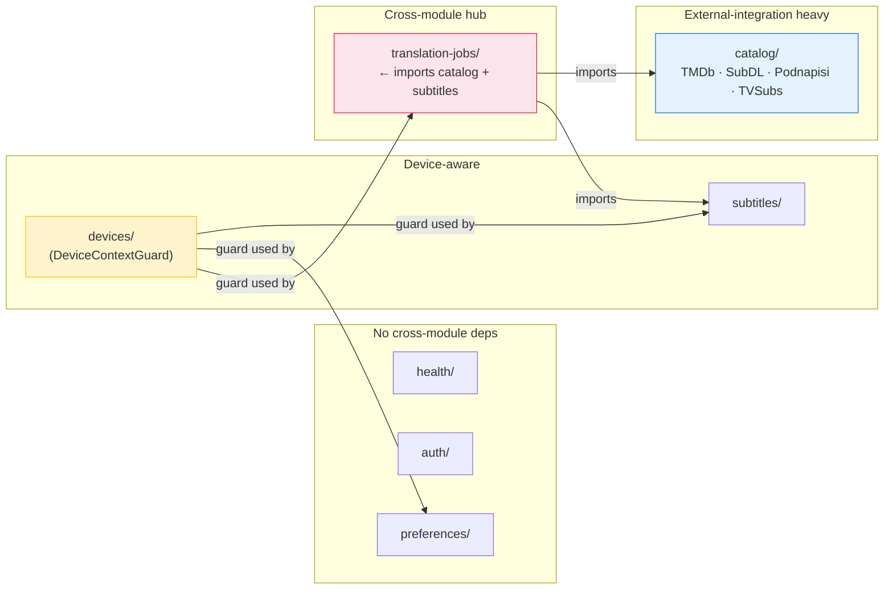
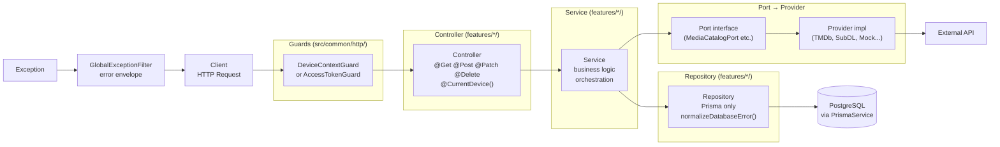
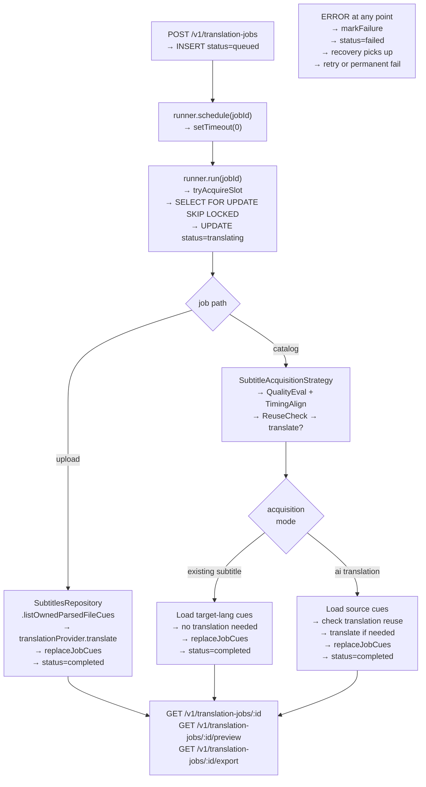
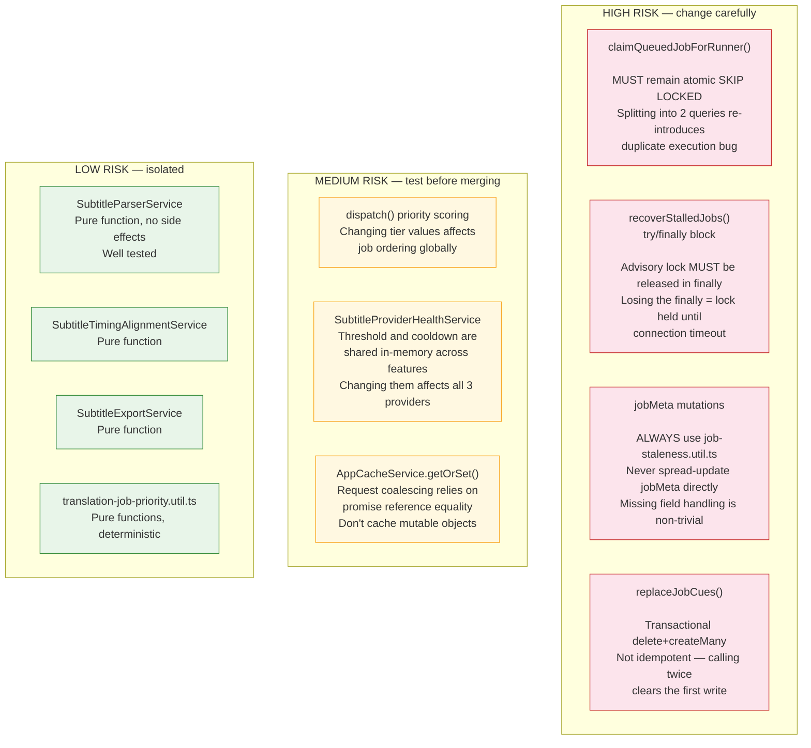
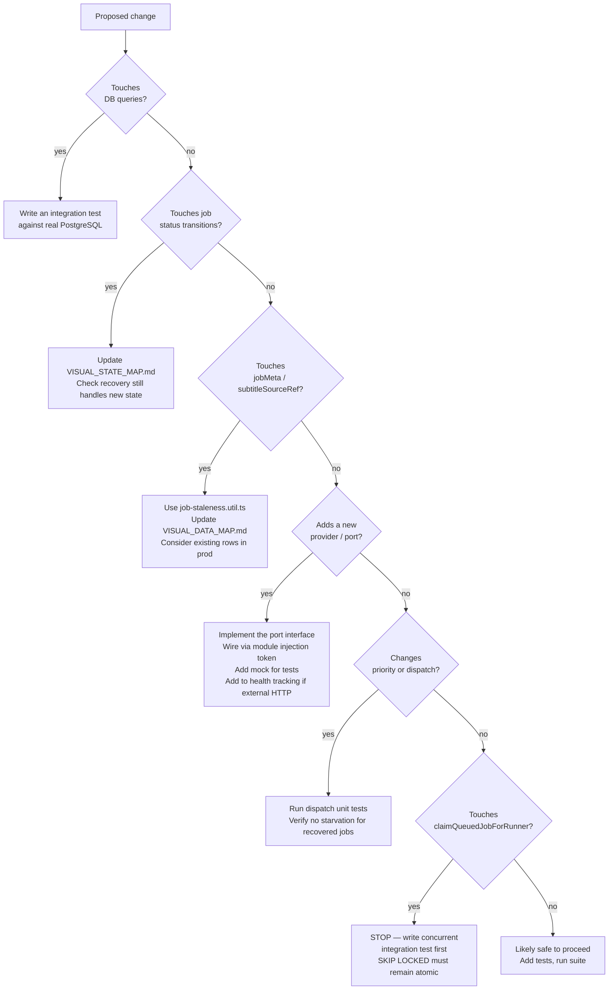
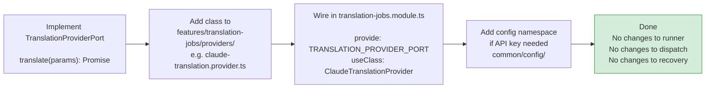
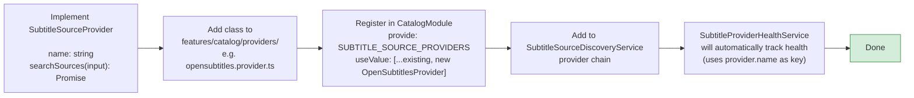

# Visual Contributor Guide

> **Docs index:** [README.md](../README.md) · **See also:** [CODEBASE_REVIEW_NOTES.md](../reference/CODEBASE_REVIEW_NOTES.md) · [FEATURE_MAP.md](../architecture/FEATURE_MAP.md) · [KEY_DIAGRAMS.md](../KEY_DIAGRAMS.md)
>
> **Covers:** "where do I go" flowchart, module ownership, request tracing, job tracing, risky areas (red/amber/green), safe-change checklist, test coverage map, add-a-provider guides.
> **Does not cover:** candid written review (→ CODEBASE_REVIEW_NOTES), full feature responsibilities (→ FEATURE_MAP).

Quick-reference maps for contributors: where to go, what to watch out for, and how to trace a problem.

---

## 1. "Where Do I Go When Working On X?"

```mermaid
flowchart TD
    START{What do you\nneed to change?}

    START --> A["Auth / OAuth / tokens"]
    START --> B["Preferences / settings"]
    START --> C["Upload / parse subtitles"]
    START --> D["Media search / TMDb"]
    START --> E["Subtitle source providers"]
    START --> F["Subtitle quality scoring"]
    START --> G["Translation job lifecycle\n(create, retry, list, export)"]
    START --> H["Job execution logic\n(how a job runs)"]
    START --> I["Dispatch / slot management"]
    START --> J["Stall recovery"]
    START --> K["Multi-instance coordination"]
    START --> L["Rate limits"]
    START --> M["Error responses / envelope"]
    START --> N["Config / env vars"]

    A --> FA["features/auth/\nauth.service.ts\nauth.repository.ts\nfirebase-auth.service.ts"]
    B --> FB["features/preferences/\npreferences.service.ts\npreferences.repository.ts"]
    C --> FC["features/subtitles/\nsubtitle-parser.service.ts\nsubtitles.repository.ts"]
    D --> FD["features/catalog/\nproviders/tmdb-media-catalog.provider.ts\nports/media-catalog.port.ts"]
    E --> FE["features/catalog/providers/\nsubdl.provider.ts\npodnapisi.provider.ts\ntvsubs.provider.ts"]
    F --> FF["features/catalog/\nsubtitle-quality-evaluation.service.ts\nsubtitle-timing-alignment.service.ts"]
    G --> FG["features/translation-jobs/\ntranslation-jobs.service.ts\ntranslation-jobs.controller.ts\ntranslation-jobs.repository.ts"]
    H --> FH["features/translation-jobs/\ntranslation-job-runner.service.ts\nsubtitle-acquisition-strategy.service.ts\ntranslation-reuse.service.ts"]
    I --> FI["features/translation-jobs/\ntranslation-job-dispatch.service.ts\ntranslation-job-execution-limiter.service.ts\nutils/translation-job-priority.util.ts"]
    J --> FJ["features/translation-jobs/\ntranslation-job-recovery.service.ts\nutils/job-staleness.util.ts"]
    K --> FK["features/translation-jobs/\ntranslation-jobs.repository.ts\n(claimQueuedJobForRunner\ntryAcquireRecoveryAdvisoryLock)"]
    L --> FL["common/rate-limit/\nrate-limit.service.ts"]
    M --> FM["common/http/filters/\nglobal-exception.filter.ts\ncommon/domain/errors/"]
    N --> FN["common/config/\n*.config.ts (8 namespaces)"]
```

---

## 2. Module Ownership Map

---

## 3. Request Tracing Map

> Follow a request from client to DB and back.

---

## 4. Job Tracing Map

> Follow a translation job from creation to completion.

---

## 5. Risky Areas Map

> Areas where mistakes are hard to reverse or have broad impact.

---

## 6. Safe-Change Checklist

When adding new behavior, use this to assess impact:

---

## 7. Test Coverage Map

> Where to add tests for each type of change.

| Change area | Test type | Location |
|-------------|-----------|----------|
| Subtitle parser / export logic | Unit | `test/unit/features/subtitles/` |
| Job retry metadata utilities | Unit | `test/unit/features/translation-jobs/` |
| Dispatch priority algorithm | Unit | `test/unit/features/translation-jobs/` |
| Recovery advisory lock | Integration | `test/integration/features/translation-jobs/` |
| SKIP LOCKED concurrent claim | Integration | `test/integration/features/translation-jobs/` |
| Repository ownership isolation | Integration | `test/integration/features/*/` |
| HTTP routes / request validation | E2E | `test/e2e/features/*/` |
| Error envelope shape | E2E | `test/e2e/` |
| Provider circuit breaker | Unit | `test/unit/features/catalog/` |
| Cache request coalescing | Unit | `test/unit/common/cache/` |

---

## 8. Adding a New Translation Provider

> The cleanest extensibility path in the system.

---

## 9. Adding a New Subtitle Source Provider

