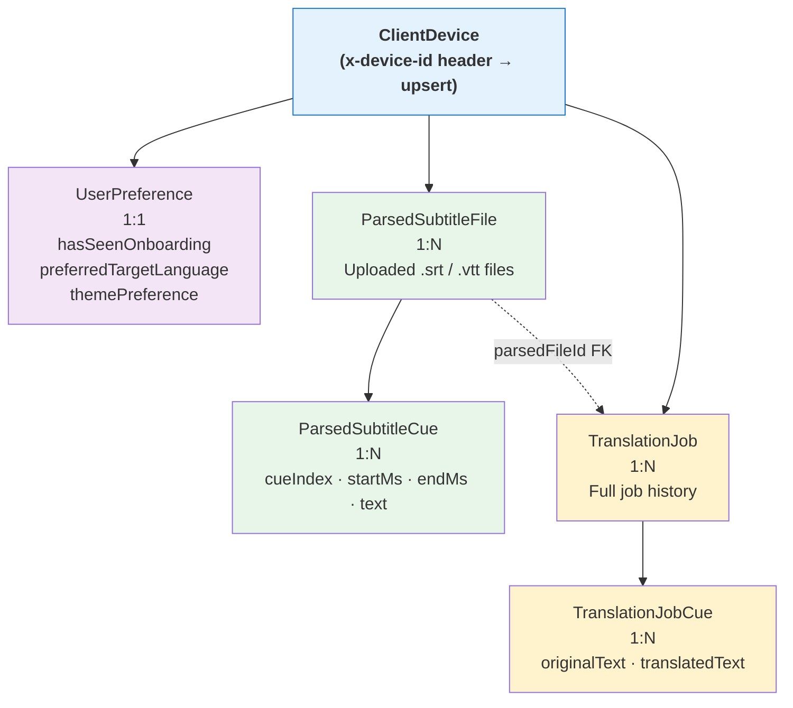
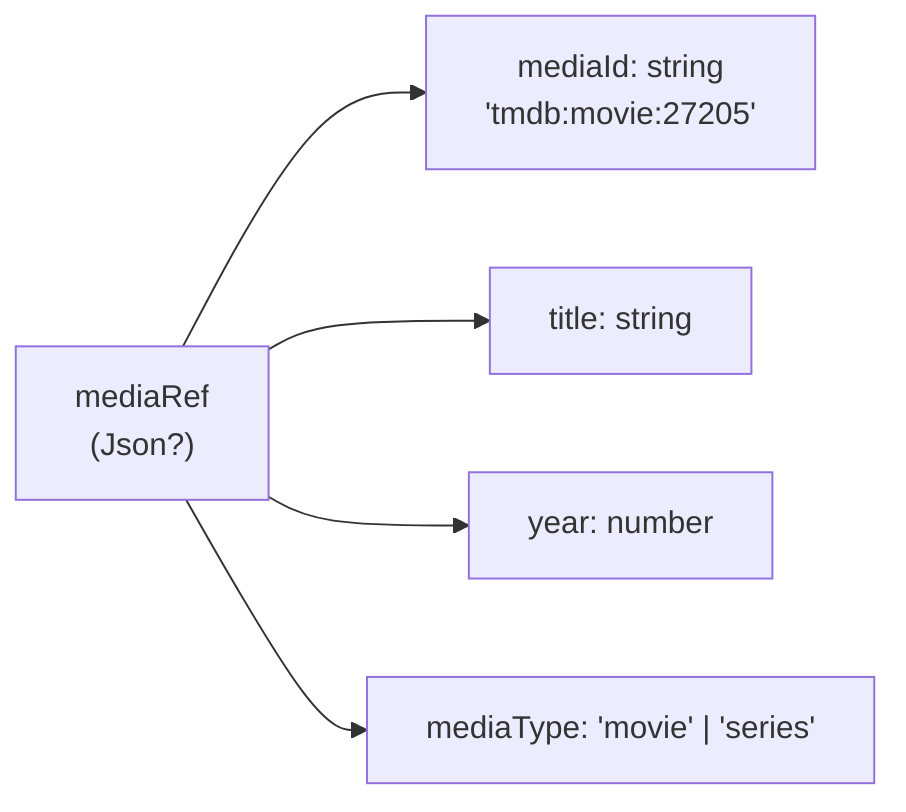
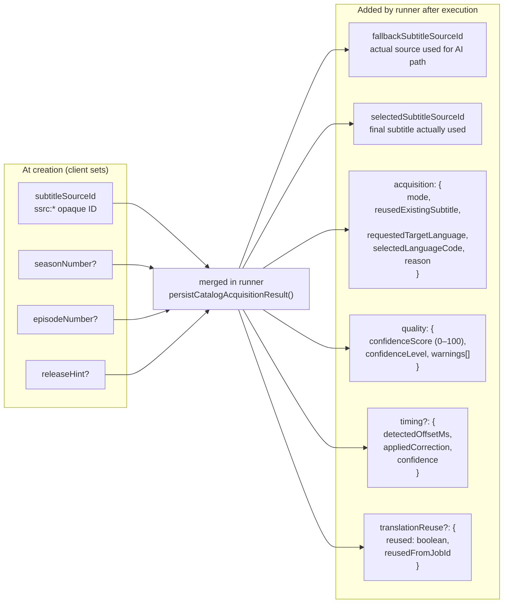
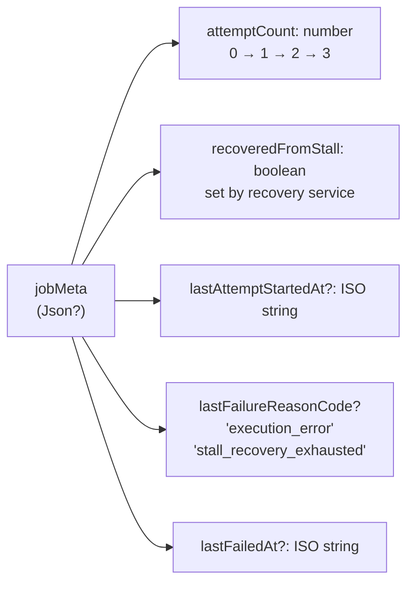
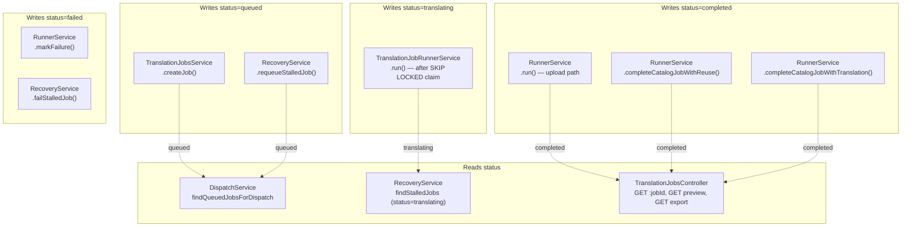
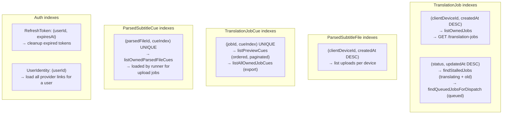
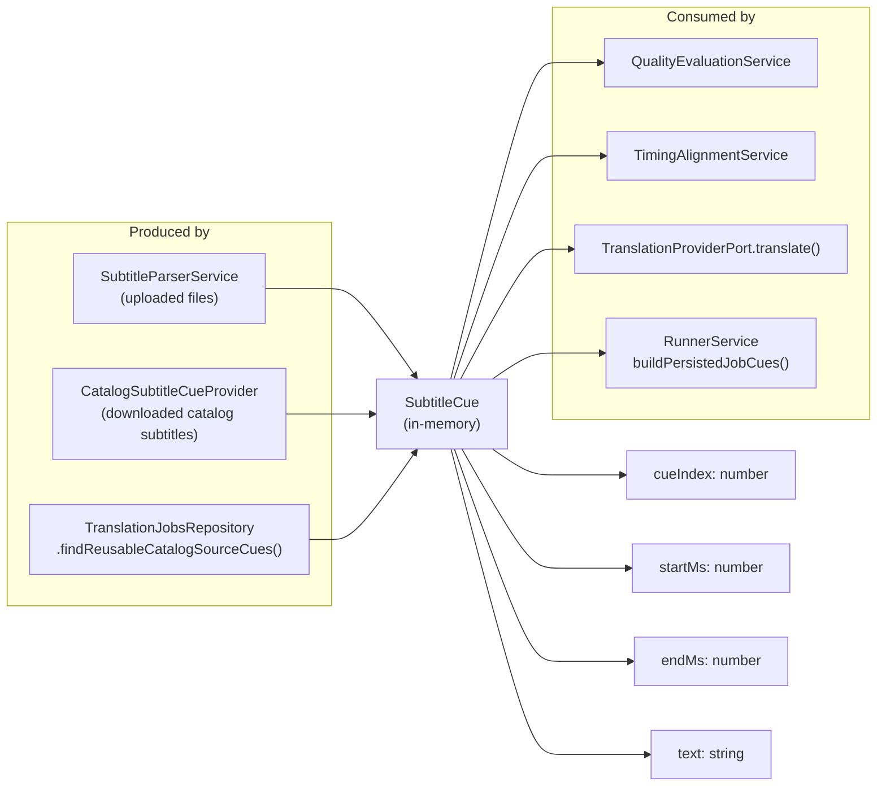

# Visual Data Map

> **Docs index:** [README.md](../README.md) · **See also:** [DATA_AND_STATE_MODEL.md](../reference/DATA_AND_STATE_MODEL.md) · [VISUAL_STATE_MAP.md](VISUAL_STATE_MAP.md) · [KEY_DIAGRAMS.md](../KEY_DIAGRAMS.md)
>
> **Covers:** full ERD, ownership hierarchy, all three JSON blob schemas (`mediaRef` / `subtitleSourceRef` / `jobMeta`), read/write ownership map, DB index → query pattern map, `SubtitleCue` internal model flow.
> **Does not cover:** state transitions (→ VISUAL_STATE_MAP), field-level reference tables (→ DATA_AND_STATE_MODEL).

Visual guide to the data model: entity relationships, JSON blob schemas, and who reads/writes each piece of state.

---

## 1. Entity Relationship Diagram

```mermaid
erDiagram
    User {
        uuid id PK
        string email UK
        string passwordHash "nullable"
        boolean emailVerified
    }

    UserIdentity {
        uuid id PK
        uuid userId FK
        enum provider "email|firebase_google|firebase_facebook|firebase_apple"
        string providerUserId
        string email "nullable"
    }

    RefreshToken {
        uuid id PK
        uuid userId FK
        string tokenHash UK
        datetime expiresAt
        datetime revokedAt "nullable"
        datetime lastUsedAt "nullable"
    }

    EmailVerificationToken {
        uuid id PK
        uuid userId FK
        string tokenHash UK
        datetime expiresAt
        datetime consumedAt "nullable"
    }

    PasswordResetToken {
        uuid id PK
        uuid userId FK
        string tokenHash UK
        datetime expiresAt
        datetime consumedAt "nullable"
    }

    ClientDevice {
        uuid id PK
        string deviceId UK
    }

    UserPreference {
        uuid id PK
        uuid clientDeviceId FK UK
        enum preferredTargetLanguage
        enum themePreference
        boolean hasSeenOnboarding
    }

    ParsedSubtitleFile {
        uuid id PK
        uuid clientDeviceId FK
        string fileName
        enum format "srt|vtt"
        enum sourceLanguage
        int lineCount
        int durationMs
        string checksum
        text rawContent
    }

    ParsedSubtitleCue {
        uuid id PK
        uuid parsedFileId FK
        int cueIndex
        int startMs
        int endMs
        text text
    }

    TranslationJob {
        uuid id PK
        uuid clientDeviceId FK
        uuid parsedFileId FK "nullable upload-only"
        enum sourceType "catalog|upload"
        enum status "queued|translating|completed|failed"
        enum targetLanguage
        float progress
        json mediaRef "nullable catalog-only"
        json subtitleSourceRef "nullable catalog-only"
        json jobMeta "retry tracking"
        datetime startedAt "nullable"
        datetime completedAt "nullable"
    }

    TranslationJobCue {
        uuid id PK
        uuid jobId FK
        int cueIndex
        int startMs
        int endMs
        text originalText
        text translatedText "nullable"
    }

    User ||--o{ UserIdentity : "has"
    User ||--o{ RefreshToken : "has"
    User ||--o{ EmailVerificationToken : "has"
    User ||--o{ PasswordResetToken : "has"
    ClientDevice ||--o| UserPreference : "has"
    ClientDevice ||--o{ ParsedSubtitleFile : "owns"
    ClientDevice ||--o{ TranslationJob : "owns"
    ParsedSubtitleFile ||--o{ ParsedSubtitleCue : "contains"
    ParsedSubtitleFile ||--o{ TranslationJob : "source for"
    TranslationJob ||--o{ TranslationJobCue : "produces"
```

---

## 2. Ownership Hierarchy

> All private data is scoped to a `ClientDevice`.



---

## 3. TranslationJob JSON Blobs

Three `Json?` columns carry typed-but-schema-less data. These are the trickiest fields in the model.

### 3a. `mediaRef` (catalog jobs only)



Written at job creation. Read by the runner to look up media details.

---

### 3b. `subtitleSourceRef` — evolution over job lifecycle



---

### 3c. `jobMeta` — retry tracking



Managed exclusively through `job-staleness.util.ts` — never write to `jobMeta` directly.

---

## 4. Who Reads / Writes Key State



---

## 5. Database Indexes and Query Patterns



---

## 6. `SubtitleCue` — The Internal Normalized Model

This is NOT a Prisma entity. It's the shared in-memory type that flows between parser, catalog providers, quality evaluation, timing alignment, and the translation runner.


